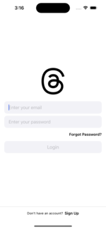
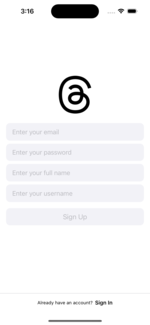
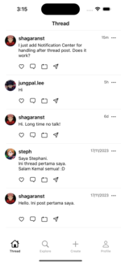
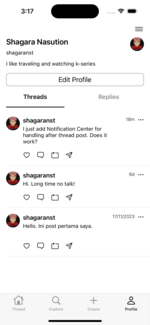
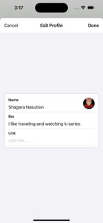

# iOS-Thread-Clone-App
Thread Clone iOS App with Swift.

# Specs
* iOS 14 and later
* MVVM
* Programmatically UI (UIKit)
* [Firebase](https://firebase.google.com/docs/ios/setup)
* [SDWebImage](https://github.com/SDWebImage/SDWebImage)

# Preview

\

\

